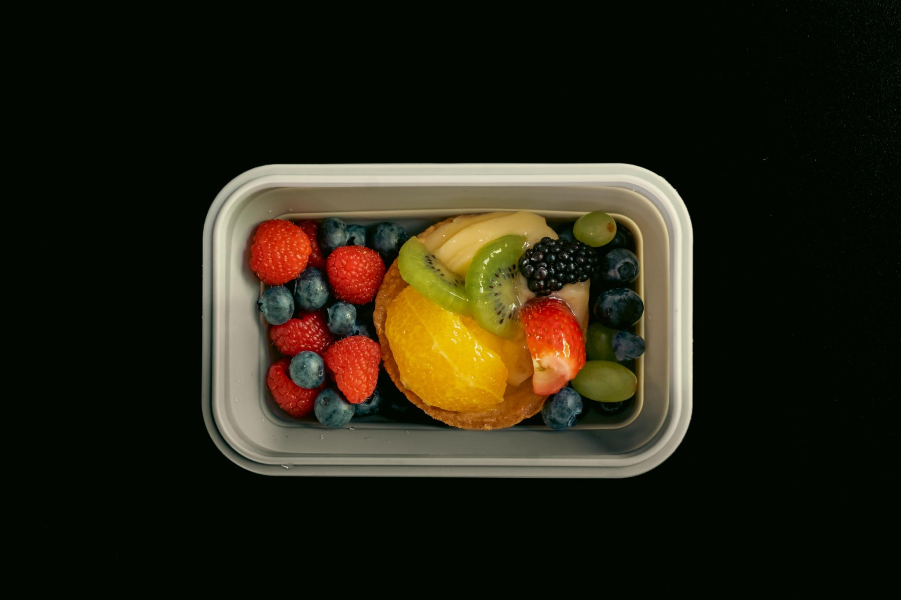
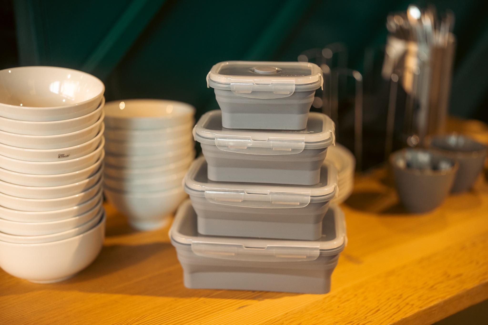

# Fold-A-Box: Student-Run Startup Project

## 📦 Overview
Fold-A-Box was a student-led import and sales startup launched as part of a commerce project at Rotterdam Business School. Our mission: offer a practical, sustainable lunchbox that folds to save space — while achieving real-world business results across procurement, marketing, and financial performance.

## 🎯 Problem & Solution
### Problem
Traditional lunchboxes take up unnecessary space after use, offer little flexibility, and lack sustainability.

### Our Solution
We imported high-quality, BPA-free, foldable silicone lunchboxes from China, offering:
- 60% space reduction
- Microwave, dishwasher, and freezer safe
- Eco-friendly and reusable
- Lower price point than competitors like Mepal

## 📈 Business Strategy
- **Market Focus:** Students and young professionals seeking convenience and affordability
- **Pricing:** Penetration pricing to undercut competitors and stimulate demand
- **Channels:** Direct-to-consumer sales via pop-up stores, personal networks, and social media
- **CSR:** 15% of profits donated to the Rotterdam FoodBank

## 💰 Financial Outcomes
- **Revenue:** €2,502
- **Gross Profit:** €1,532
- **Net Profit:** €1,017
- **ROI for Investors:** 13%
- **Donation:** €150 raised for the FoodBank

## 📸 Product Gallery

### 📦 1200ml Green, Blue and Pink Boxes

### 📦 Fold-a-Box Sets in All Colors

### 🍓 Fold-a-Box in Use (800ml with Food)

### 🔄 Unfolded Blue Set Stack

## 📊 Project Deliverables
- Shareholder Pitch
- Business Plan
- Financial & Sales Forecast
- Quarterly Report
- P&L Statement 

## 🧠 Lessons Learned
- Market research is essential to successful positioning
- Clear communication and task delegation improve team productivity
- Financial planning and cost control directly impact ROI
- Even small-scale entrepreneurship can create social impact

## 🙌 Acknowledgements
Thanks to our investors, advisors, and the Rotterdam Business School faculty.

---

*This project demonstrates practical application of international business and entrepreneurship principles, from market entry and supply chain decisions to finance, CSR, and product marketing.*
